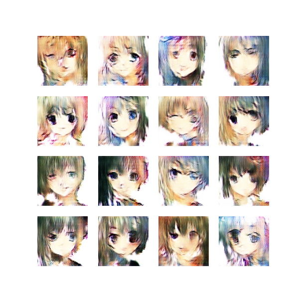

# GANs Avatar Faces Model 🤖


## Avatar Faces Generator Model with TensorFlow

This Deep Convolutional Generative Adversarial Network `(GANs)` generates Avatar Faces.

It was trained with over 20.000 Images, using TensorFlow and the Google Colab GPU.

## Check-it out
Test the Model by running the `app.py` file, built with `Streamlit`.

The code of the Model is in the  `gans_avatar_faces.ipynb` file.



## Run
```sh
streamlit run app.py
```

## Resources
- Avatar Dataset: https://www.kaggle.com/datasets/soumikrakshit/anime-faces
  
- Code Explained: https://mendezluisjose.hashnode.dev/gans-avatar-faces-generator-model
